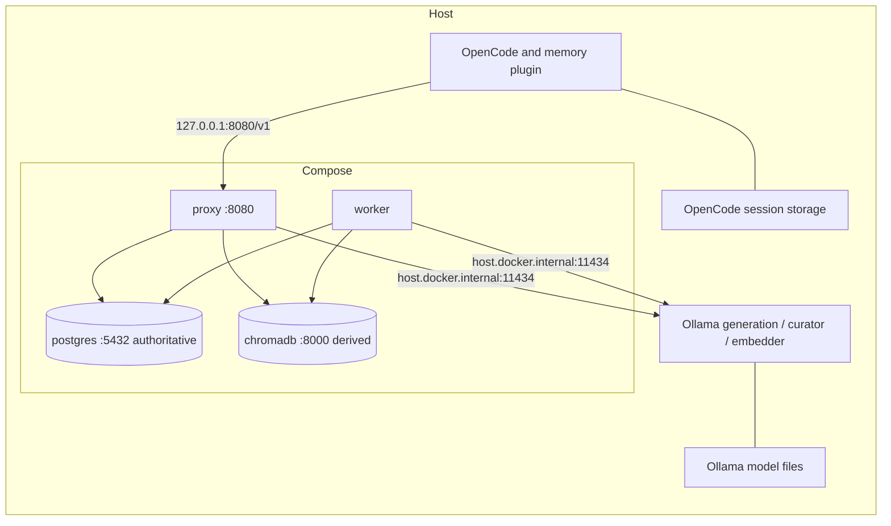

# Local OpenCode project memory: operations guide

This guide is for the operator or on-call engineer responsible for one local deployment. It covers service health, durable state, maintenance, and recovery. Use the [user guide](user-guide.md) for installation, normal OpenCode use, and session workflows; the [README](../README.md) is the project entry point.

Run commands from this checkout. Examples assume the default Compose file and port 8080. Replace placeholder paths and exact IDs before executing. Keep the same checkout directory, `COMPOSE_PROJECT_NAME`, and `COMPOSE_FILE` throughout maintenance. Never source `.env` as shell code. Inspect configuration privately; `docker compose config --quiet` validates without printing secrets.

## Contents

- [Scope and support matrix](#scope-and-support-matrix)
- [Topology and ownership](#topology-and-ownership)
- [Request and background flows](#request-and-background-flows)
- [Configuration and capacity](#configuration-and-capacity)
- [Runtime context acceptance](#runtime-context-acceptance)
- [Standard runbooks](#standard-runbooks)
- [Health and observability](#health-and-observability)
- [Backup and restore](#backup-and-restore)
- [Migrations](#migrations)
- [Reindex and embedding changes](#reindex-and-embedding-changes)
- [Upgrade and rollback](#upgrade-and-rollback)
- [Incident triage](#incident-triage)
- [Emergency runbooks](#emergency-runbooks)
- [Reset and disaster recovery](#reset-and-disaster-recovery)
- [Security and scaling limits](#security-and-scaling-limits)

## Scope and support matrix

This is a single-user local system without high availability, managed backups, or automatic retention. The baseline records this checkout's verified versions; it is not a compatibility guarantee for other releases.

| Surface | Baseline / constraint |
| --- | --- |
| Operator host | macOS and Linux; Windows/WSL operator workflows unverified |
| Reference hardware | Apple M5 Max, 36 GB unified memory; not a minimum or 64K capacity guarantee |
| OpenCode / Ollama | 1.18.30 / 0.35.0, on host |
| Docker / Compose | 29.8.1 / 5.5.1; daemon must run |
| Application | Python 3.12 (`>=3.12,<3.13`), locked dependencies via uv |
| Plugin tests | Node.js 24.21.0 verified; no lower minimum established |
| Database / vector images | `postgres:16-bookworm` / `chromadb/chroma:0.6.3` |
| Maintenance tools | Git, Make, POSIX shell, curl; PostgreSQL tools run inside its container |

Host tools are installed by the operator. Make never installs them and forces `UV_PYTHON_DOWNLOADS=never`; uv can still download project packages. Revalidate upstream behavior after upgrades.

## Topology and ownership



Text equivalent: host OpenCode → loopback proxy → host Ollama; proxy and worker use internal PostgreSQL and Chroma. The worker independently calls the same Ollama for curation/embedding. OpenCode sessions and downloaded models are not Docker volumes.

| Owner / service | Access and dependencies | Persistence and health |
| --- | --- | --- |
| Host OpenCode | `local-rag` provider → proxy; plugin supplies identity headers | Own host session store; resolved config and real prompt |
| Host Ollama | Containers use `host.docker.internal:11434`; host CLI uses `OLLAMA_HOST` | Own model directory; catalog presence differs from inference |
| `proxy` | Only publication `127.0.0.1:${PROXY_PORT:-8080}:8080`; depends on healthy postgres/chromadb | No private durable volume; liveness plus valid dependency report |
| `worker` | No host port; waits for postgres/chromadb and migrated proxy health | Jobs/checkpoints in PostgreSQL; process and dependency health |
| `postgres` | Internal `postgres:5432`, no host publication | `postgres_data` at `/var/lib/postgresql/data`; `pg_isready` |
| `chromadb` | Internal `chromadb:8000`, no host publication | `chroma_data` at `/chroma/chroma`; `/api/v1/heartbeat` |

All four services restart `unless-stopped`. Both apps run Alembic before their main command; worker ordering serializes initial migrations in normal startup. One-off `docker compose run proxy ...` also runs that entrypoint unless explicitly overridden. Do not run concurrent migration containers.

Docker Desktop provides the host name on macOS; Compose adds `host-gateway` for Linux. Linux loopback-only Ollama generally cannot receive gateway traffic. Preserve a Docker-reachable listener and firewall port 11434 against untrusted networks. Container `127.0.0.1` addresses that container. See [Ollama server environment configuration](https://docs.ollama.com/faq#how-do-i-configure-ollama-server). Identity headers do not authenticate callers.

## Request and background flows

1. OpenCode identifies project/session. The plugin hashes OpenCode project identity with normalized origin remote, falling back to canonical directory/worktree root. Changed identity can select another namespace; a model switch alone does not.
2. The proxy validates identity, configured generation model, messages, and tool chains. It captures inbound events in PostgreSQL before treating old history as durable.
3. It embeds the current query, searches project-filtered Chroma, revalidates active memories against PostgreSQL, and builds bounded recent history plus historical evidence.
4. Ollama serves HTTP/SSE back to OpenCode. Only successfully finalized assistant completions create curation sources/jobs; interrupted streams retain diagnostics without curating partial answers.
5. The worker claims an eligible job with a fenced PostgreSQL lease, curates/validates evidence, persists memories/checkpoints, embeds in batches of 16, and upserts vectors under stable PostgreSQL IDs. Completion/retry state is durable.

Default worker settings: one job at a time, one-second idle polling, 600-second lease, work bounded to 599 seconds. Claims increment attempts; expired leases can be reclaimed. Five attempts are allowed, with exponential retry delay starting at two seconds and capped at 300 seconds. Lease/poll/batch defaults are constructor settings, not exposed concurrency environment variables.

Authoritative tables: `projects`, `sessions`, `conversation_events`, `memory_items`, `memory_sources`, `memory_jobs`, and `alembic_version`. PostgreSQL `sessions` associates captured events with OpenCode IDs; it does not replace the client's session store. Active normalized memory text is unique per project; source checkpoints preserve independent supporting events. Old-source retries do not revive retired memory. Empty curation is a valid completed job.

## Configuration and capacity

Review [.env.example](../.env.example), [Settings](../src/local_dev_rag/config.py), [Compose](../compose.yaml), and [OpenCode config](../opencode.json) together. Use recreation after environment/image changes; [Compose restart does not apply changed configuration](https://docs.docker.com/reference/cli/docker/compose/restart/).

| Setting | Default and invariant |
| --- | --- |
| `PROXY_PORT` | Host 8080; synchronize OpenCode provider `baseURL` |
| `PROXY_HOST`, `ALLOW_REMOTE_BIND` | App defaults loopback/false; Compose fixes container bind to `0.0.0.0:8080`, true, with host loopback publication |
| `POSTGRES_USER`, `POSTGRES_PASSWORD`, `POSTGRES_DB` | Example `local_rag`; choose before initialization; edits do not rotate existing credentials |
| `DATABASE_URL` | Blank constructs encoded asyncpg URL from raw credentials; explicit override must match PostgreSQL and percent-encode reserved characters |
| `POSTGRES_HOST`, `POSTGRES_PORT`, `CHROMADB_URL` | Compose fixes `postgres`, `5432`, `http://chromadb:8000` |
| `OLLAMA_URL` | `http://host.docker.internal:11434`; same server as host CLI `OLLAMA_HOST` |
| `DEFAULT_MODEL` | `qwen3-coder:30b`, registry setting; HTTP chat still requires explicit `model`. OpenCode default is its separate `model` field |
| `CURATOR_MODEL` | `qwen2.5-coder:1.5b`; explicit tagged ID required by operator checks |
| `EMBEDDING_MODEL`, `EMBEDDING_VERSION` | `nomic-embed-text:latest`, `1`; add version to `.env` when managing it; coordinate all-project rebuilds |
| `MODEL_BUDGETS` | JSON policy below; model overrides merge with Python defaults |
| `MEMORY_TOKEN_BUDGET` | 1024; historical-evidence maximum, not recall guarantee |
| `RETRIEVAL_CANDIDATE_LIMIT`, `RETRIEVAL_RESULT_LIMIT`, `RETRIEVAL_MIN_SCORE` | 20, 6, 0.35 |
| `RANKING_WEIGHTS` | Semantic .55, importance .15, recency .10, overlap .15, diversity .05; positive weights normalized; half-life 30 days, raw semantic floor .2 or exact token overlap before bonuses |
| `RETRY_MAX_ATTEMPTS`, `RETRY_INITIAL_SECONDS`, `RETRY_MAX_SECONDS` | 5, 2, 300; changed limits do not requeue terminal failures |
| `UPSTREAM_TIMEOUT_SECONDS`, `LOG_LEVEL` | 120 per upstream request, `INFO` |

| Model | Context / output / safety | Estimated input allowance |
| --- | --- | --- |
| `qwen3-coder:30b`, `llama3.1:8b` | 65536 / 8192 / 4096 | 53248 |
| `qwen2.5-coder:1.5b`, `qwen2.5-coder:7b`, `qwen2.5:7b` | 32768 / 4096 / 2048 | 26624 |

Context must exceed output plus safety; client context/output must agree with proxy policy and actual runtime allocation. Estimates use serialized UTF-8 bytes divided by three, rounded up, not an exact tokenizer. Protected current/system/tool payloads can themselves exceed the target. PostgreSQL-degraded passthrough does not trim on assumed durability.

Capacity includes loaded weights, context caches, foreground/curator/embedder contention, Docker, development tools, models, growing events/vectors/logs, backups, and free restore/reindex workspace. No universal RAM/disk minimum or throughput SLO is established. Observe `ollama ps`, `docker stats --no-stream`, `docker system df`, host memory pressure, and `df -h`; also check Docker Desktop VM disk capacity. Keep headroom and reduce simultaneous inference before assuming longer timeouts fix saturation.

## Runtime context acceptance

The proxy does not set native Ollama `num_ctx`. Declared 65536 budgets and `ollama show` metadata do not establish loaded allocation. The reference host produced a short Qwen3 reply while `ollama ps` showed 32768: that is an unresolved 64K acceptance failure. The dedicated [Ollama context guide](https://docs.ollama.com/context-length) explains inspection and memory costs; the [OpenAI compatibility guide](https://docs.ollama.com/api/openai-compatibility#setting-the-local-context-size) explains the API limitation.

```sh
opencode run --model local-rag/qwen3-coder:30b \
  'Without using tools, reply exactly CONTEXT_CHECK_OK.'
ollama ps
```

Accept 64K only when that loaded model's `CONTEXT` is at least 65536; inspect CPU/GPU offloading too. Repeat for `llama3.1:8b`; require at least 32768 for the Qwen2.5 generation models. A missing row needs a fresh prompt and immediate recheck. A short answer or green readiness cannot certify long-input safety.

Two remedies are available; record the explicit policy choice:

1. **Increase allocation.** Pause clients and worker inference before restarting the existing Ollama service. Set context to 65536 through its app/service environment. For a manually served instance only, stop that server cleanly, then run `OLLAMA_CONTEXT_LENGTH=65536 ollama serve`, preserving reachable listener/firewall settings. A client-shell variable does not reconfigure an existing daemon. Resume worker/clients, require `make ready`, repeat prompt and `ollama ps`. OOM means the remedy failed on that host.
2. **Lower policy to verified capacity.** For each affected model, set OpenCode context/output to 32768/4096 and `.env` `MODEL_BUDGETS` context/output/safety to 32768/4096/2048, retaining other entries. If adopting repository policy, synchronize `.env.example` and `_default_budgets()` in `src/local_dev_rag/config.py` too; local overrides must be explicit. Run `make recreate`, restart OpenCode, inspect resolved config, require `make ready`, and repeat the prompt/allocation gate. Derive matching reserves explicitly for any lower capacity.

Both remedies interrupt inference but retain stored data. Selecting a smaller configured model offers immediate relief; it does not make unchanged 64K declarations safe.

## Standard runbooks

### Preflight and provisioning

```sh
make help
make precheck
docker compose config --quiet
# Start host Ollama before asset preparation.
make essentials
```

`precheck` checks tools/versions, daemon, config, provider/plugin, and port without inference. `essentials` creates private `.env` only when absent, syncs dependencies, pulls service images/models, and builds. Review credentials before startup. `doctor-fix` syncs/builds and pulls missing assets, then diagnoses; it never starts services and can finish with a failed diagnosis on a stopped stack. Neither repairs credentials nor resets data.

### Lifecycle

| Operation | Command | Verification / impact |
| --- | --- | --- |
| Start | `make up` | Four services via `make status`; then ready and real prompt |
| Stop/remove containers and network | `make down` | `make status`; volumes retained, proxy unavailable |
| Pause containers | `docker compose stop` | `docker compose ps -a`; volumes/containers retained |
| Restart same config | `make restart` | Interrupts requests; status and ready checks |
| Build/apply config | `make recreate` | Force recreation outage; verify migrations/status/ready |
| Diagnose | `make status`, `make doctor` | Read-only revision, worker, config, models and HTTP checks; no inference |
| Follow logs | `make logs LOG_TAIL=100` | Ctrl-C stops following, not services |

Stop new clients and allow in-flight work to settle before maintenance. A forced stop can leave a lease awaiting expiry; cancelled requests do not yield completed curation sources. [Docker down preserves named volumes by default](https://docs.docker.com/reference/cli/docker/compose/down/). Do not append `--volumes` for an ordinary stop.

### Acceptance and smoke

```sh
make doctor
make ready
make smoke
```

Smoke runs real foreground/curator/embedder inference in the selected Compose database, creates two unique synthetic project namespaces, and retains records. Expect `PASS: live smoke complete; synthetic project records retained locally`. All five generation IDs plus curator/embedder must be installed. Default foreground is `qwen2.5-coder:1.5b`; use `SMOKE_MODEL=qwen2.5-coder:7b SMOKE_TIMEOUT_SECONDS=600 make smoke` when needed. Success covers accepted memory, fresh-session streaming recall, and unrelated-project isolation, not every model's tool quality. A zero-memory completed job fails this smoke's requirement.

`make check` runs Ruff, Pyright, pytest, and Compose rendering. Full pytest uses disposable PostgreSQL/Chroma and deterministic fake Ollama, not operator volumes or live inference. `uv run pytest tests/unit tests/contract -q` is narrower; review skips for missing dependencies. Record unavailable live checks as skipped, never passed.

### Overrides and deadlines

Targets honor `COMPOSE_PROJECT_NAME` and `COMPOSE_FILE`; direct examples assume default Docker/Compose. `DOCKER`, `UV`, `PYTHON`, `NODE`, `OLLAMA`, `OPENCODE` accept executable paths including spaces. Empty `COMPOSE` selects quoted `DOCKER` plus `compose`; explicit `COMPOSE` is whitespace-separated arguments without shell evaluation. Values are captured literally; command-line values take precedence.

Deadlines in whole seconds (1–86400): diagnostic subprocesses `DIAGNOSTIC_TIMEOUT_SECONDS=15`; Compose operations `COMPOSE_TIMEOUT_SECONDS=300`; Compose health wait `STARTUP_TIMEOUT_SECONDS=120`; dependency sync, each pull, and whole smoke `DOWNLOAD_TIMEOUT_SECONDS=3600`. Python enforces outer process-group deadlines without GNU timeout. Submitted Docker/server work can continue after timeout; inspect status before retrying. Logs, interactive launch, and test/static-check runtimes are unbounded by these wrappers. Direct commands below also have no wrapper deadline.

## Health and observability

```sh
curl --fail --silent --show-error http://127.0.0.1:8080/healthz
curl --silent --show-error http://127.0.0.1:8080/readyz
curl --fail --silent --show-error http://127.0.0.1:8080/v1/models
docker compose logs --tail=100 proxy worker
docker compose exec -T worker python -m local_dev_rag.worker --healthcheck
```

Liveness is `{"status":"ok"}`. Readiness requires six healthy entries: PostgreSQL `SELECT 1`, valid Chroma heartbeat, Ollama catalog, curator presence, embedder presence, durable job state. Failed/retry jobs degrade `memory_jobs`; pending/running backlog alone does not. HTTP 200 `degraded` permits reduced memory behavior; HTTP 503 `not_ready` indicates unhealthy Ollama. Readiness/model catalog do not test selected foreground-model inference, capacity, or recall.

Compose proxy health accepts valid ready/degraded/not-ready after liveness. Worker health verifies its process and reports dependencies, but only unavailable PostgreSQL makes the dependency result fail. `up --wait` therefore does not establish full readiness; full readiness does not establish successful inference.

Application JSON logs allow opaque correlation, hashed external identities/internal UUIDs, model, timing/counts, capture/stream states, and controlled error categories. Prompt/tool/memory bodies, roots, authorization, arbitrary exceptions, and access logs are suppressed even at DEBUG. This guarantee does not extend to upstream service/host logs: inspect privately. OpenCode logs reside in [its local data directory](https://opencode.ai/docs/troubleshooting/#logs).

Known telemetry limits: the worker `embedder` stage spans database persistence/vector upsert, potentially mislabeling database failures; rare iterator/cleanup `OSError` categories can ambiguously indicate cancellation/upstream failure. Correlate durable state before assigning cause. No metrics exporter, alert service, or log rotation/retention is configured here; manage host/Docker retention separately.

Count-only checks:

```sh
docker compose exec -T postgres sh -c 'psql -X -v ON_ERROR_STOP=1 -U "$POSTGRES_USER" -d "$POSTGRES_DB" -c "SELECT status, error_category, count(*) FROM memory_jobs GROUP BY status, error_category ORDER BY status;"'
docker compose exec -T postgres sh -c 'psql -X -v ON_ERROR_STOP=1 -U "$POSTGRES_USER" -d "$POSTGRES_DB" -c "SELECT status, count(*), min(created_at) AS oldest_created, min(next_attempt_at) AS earliest_due, min(lease_expires_at) AS earliest_lease FROM memory_jobs GROUP BY status;"'
docker compose exec -T postgres sh -c 'psql -X -v ON_ERROR_STOP=1 -U "$POSTGRES_USER" -d "$POSTGRES_DB" -c "SELECT (SELECT count(*) FROM projects) AS projects, (SELECT count(*) FROM conversation_events) AS events, (SELECT count(*) FROM memory_items) AS memories, (SELECT count(*) FROM memory_sources) AS sources, (SELECT count(*) FROM memory_jobs) AS jobs;"'
docker compose exec -T postgres sh -c 'psql -X -v ON_ERROR_STOP=1 -U "$POSTGRES_USER" -d "$POSTGRES_DB" -c "SELECT state, count(*) FROM memory_items GROUP BY state;"'
```

Record counts/oldest age before maintenance. Monitor growing age, retry/failure counts, unavailable capture, pressure, and backup failures against local requirements. Green readiness with growing pending jobs needs investigation.

## Backup and restore

### Boundaries and preparation

| State | Classification and recovery |
| --- | --- |
| PostgreSQL | Authoritative events/facts/provenance/lifecycle/jobs; verified logical backups required |
| Chroma | Rebuildable derived index containing accepted text; reindex PostgreSQL active memories |
| `.env`, config, revision | Private operational state; back up credentials, budgets, embedding version, source release |
| OpenCode sessions | Separate host-local client state; exports and/or cold whole-store backup |
| Ollama models | Separate host assets; preserve custom/offline weights or re-pull intended models |

No backup schedule, point-in-time recovery, or tested RPO/RTO is provided. Define retention and drill restores. A restored snapshot loses later changes. Record `git rev-parse HEAD`, `docker compose images`, `ollama list`, project name, revision, and count baseline privately. Confirm containers with `docker compose ps -a` and exact mounts with `docker inspect <exact-postgres-container-id> --format '{{json .Mounts}}'` (ID from `docker compose ps -q postgres`).

Choose a new private directory outside Git on storage with sufficient space. Never overwrite the only backup:

```sh
umask 077
mkdir -m 700 /path/to/private-backups/backup-YYYYMMDD-HHMMSS
cp -p .env /path/to/private-backups/backup-YYYYMMDD-HHMMSS/env
cp -p opencode.json compose.yaml /path/to/private-backups/backup-YYYYMMDD-HHMMSS/
docker compose exec -T postgres sh -c 'exec pg_dump -U "$POSTGRES_USER" -d "$POSTGRES_DB" -Fc' > /path/to/private-backups/backup-YYYYMMDD-HHMMSS/postgres.dump
```

Require exit 0 and nonempty dump. Failed commands may leave partial archives. `pg_dump -Fc` creates a consistent database snapshot with live writers but excludes cluster roles; retain role/configuration details separately. For coordinated maintenance and exact count comparison, stop client traffic and `docker compose stop proxy worker` before dumping. [PostgreSQL pg_dump reference](https://www.postgresql.org/docs/16/app-pgdump.html).

```sh
test -s /path/to/private-backups/backup-YYYYMMDD-HHMMSS/postgres.dump
docker compose exec -T postgres pg_restore --list < /path/to/private-backups/backup-YYYYMMDD-HHMMSS/postgres.dump
```

Check expected schema/data entries and metadata. Listing is not a restore drill: restore into a separate empty Compose project with unique project name, distinct loopback port, independent volumes, matching PostgreSQL major/image and credentials, and no client traffic. Inspect its resolved volume names before creation. Apply the sequence below there; retain the original deployment until acceptance.

### PostgreSQL restore

Prerequisites: exact destination project/database verified, current destination freshly backed up, trusted archive tested, source/schema compatible, enough free disk. Stop OpenCode traffic and both application writers:

```sh
docker compose stop proxy worker
docker compose ps -a
```

**Replacement warning:** the next command drops/replaces matching database objects and data in this container's `$POSTGRES_DB`. Newer writes are lost there. `--clean` does not remove unrelated extra objects: use a separate empty destination when schema is uncertain. Keep PostgreSQL running and do not proceed with an uncertain target/backup.

```sh
docker compose exec -T postgres sh -c 'exec pg_restore -U "$POSTGRES_USER" -d "$POSTGRES_DB" --clean --if-exists --no-owner --single-transaction --exit-on-error' < /path/to/private-backups/backup-YYYYMMDD-HHMMSS/postgres.dump
```

Require exit 0; the single transaction commits all changes or none. Keep writers stopped on failure. Restore only trusted archives because SQL is executed. [PostgreSQL pg_restore reference](https://www.postgresql.org/docs/16/app-pgrestore.html).

Inspect revision without automatic startup migration:

```sh
docker compose run --rm --no-deps --entrypoint alembic proxy current
```

Compare count queries with baseline, allowing only documented snapshot timing differences. Verify schema using [migrations](#migrations) before applying an upgrade. Existing vectors may be stale: keep writers stopped and [reindex every restored project](#reindex-and-embedding-changes), then start and verify:

```sh
docker compose up -d --wait --wait-timeout 120 proxy worker
make doctor
make ready
```

Test an existing known memory in a fresh same-project session and unrelated-project isolation. Optional smoke checks new synthetic memory, not restored historical correctness. Restored terminal jobs can keep readiness degraded and need explicit investigation. Chroma/session exports alone cannot reconstruct all PostgreSQL state.

### Other state

Chroma normally recovers by reindexing. Optional filesystem snapshots must be cold: stop proxy/worker/Chroma, confirm stopped state, then use your volume-backup tool on only the exact resolved `chroma_data` volume. Verify archive readability; record Chroma image and embedding model/version. Never copy live SQLite/index files or restore over a running server. Prefer rebuilding over uncertain vectors. After restart require ready and scoped recall.

Before restoring `.env`, preserve the current file and compare credentials with initialized PostgreSQL. Old settings may select the wrong database or collection. Verify private permissions and `docker compose config --quiet`, recreate apps, then doctor/ready. Protect all backups with encryption/access controls.

Export important client sessions to new paths:

```sh
umask 077
opencode session list
opencode export ses_REPLACE_WITH_REAL_ID > /path/to/private-backups/session-unique.json
```

Require exit 0 and privately validate JSON. To recover a trusted export, run `opencode import /path/to/private-backups/session-unique.json`, then list/open that session. Import writes client history; it does not automatically rebuild PostgreSQL memory. [OpenCode export/import](https://opencode.ai/docs/cli/#export).

For whole-store backup, exit OpenCode and its relevant background server before copying its actual data directory. Documented macOS/Linux default is `~/.local/share/opencode/`; verify overrides first. Preserve the full store/permissions including SQLite sidecars; credentials may be present. Test restore in a separate stopped profile, or move the current store to a private recovery location before replacing it. Verify sessions/provider/login state. Never delete that directory as routine repair. [OpenCode storage](https://opencode.ai/docs/troubleshooting/#storage).

Ollama defaults: `~/.ollama/models` on macOS, `/usr/share/ollama/.ollama/models` for standard Linux installation, overridden by `OLLAMA_MODELS`. Record model IDs/digests (`ollama list`), custom Modelfiles, and server settings. Mutable tags can change on re-pull. Back up actual model files with no active pulls/writes for custom/offline recovery, retaining service ownership. After restore verify list, real inference, and runtime context. [Ollama model storage](https://docs.ollama.com/faq#where-are-models-stored).

## Migrations

Final revision is `0001`. Older unreleased intermediate schemas also used `0001`; the string alone is insufficient. Final schema includes `memory_sources` and partial unique index `uq_memory_active_text`. Compare definitions/constraints/columns against [migration](../migrations/versions/0001_initial_memory_schema.py) and [schema](../src/local_dev_rag/schema.py):

```sh
docker compose exec -T postgres sh -c 'psql -X -v ON_ERROR_STOP=1 -U "$POSTGRES_USER" -d "$POSTGRES_DB" -c "SELECT version_num FROM alembic_version;" -c "\d memory_sources" -c "\d memory_items" -c "\d memory_jobs"'
```

Intermediate databases require backup and an explicit record/checkpoint migration, deduplication, and reindex. `upgrade head` cannot install changes behind the same revision. Recreate only disposable development data after reset safeguards.

Migration changes schema and can break old app compatibility. Prerequisites: verified backup, previous image/config/revision recorded, reviewed compatible migration, healthy PostgreSQL, stopped traffic. `make migrate` executes inside a running proxy and does not stop writers. Prefer a single maintenance container while both writers are stopped:

```sh
docker compose stop proxy worker
docker compose ps -a
docker compose run --rm --no-deps --entrypoint alembic proxy upgrade head
docker compose run --rm --no-deps --entrypoint alembic proxy current
```

Require successful exits, expected head, schema and count checks before `docker compose up -d --wait --wait-timeout 120 proxy worker`, doctor/ready, and real prompt/recall. On failure keep writers stopped; do not force/stamp/downgrade blindly. Initial downgrade drops application tables. Restore into a compatible deployment if reviewed repair is unavailable.

## Reindex and embedding changes

Reindex deletes one exact project's vectors in the **current collection** before rebuilding active PostgreSQL memories in batches of 16. Events/memory text remain, but embedding metadata updates. Failure after deletion leaves missing/partial recall until retry. It does not rerun extraction or clear failed jobs. Unknown project/dependency failure exits nonzero with content-free output.

Prerequisites: verified PostgreSQL backup, exact external ID, healthy PostgreSQL/Chroma/Ollama embedding inference, enough disk, accepted recall outage. Stop clients/writers for a stable snapshot. Enumerate IDs privately:

```sh
docker compose exec -T postgres sh -c 'psql -X -v ON_ERROR_STOP=1 -U "$POSTGRES_USER" -d "$POSTGRES_DB" -c "SELECT external_project_id FROM projects ORDER BY created_at;"'
docker compose stop proxy worker
docker compose ps -a
docker compose run --rm --no-deps --entrypoint python proxy -m local_dev_rag.cli reindex --project '<exact-external-project-id>'
```

Require exit 0 and `reindexed=N`, compared with that project's active count while stopped. Repeat for every restored project, including zero-active projects to remove stale vectors. On failure keep clients stopped, repair dependency, rerun the exact project. Afterwards start proxy/worker, require readiness, test known recall and unrelated-project isolation. Zero is valid only with no active memories.

Online shortcut: `make reindex PROJECT=<exact-id>` executes in the running proxy, rejecting empty IDs, whitespace/shell syntax, leading dashes, and IDs over 256 characters. Use the one-off command for stopped-writer maintenance.

For embedding model/weight/index-semantics changes: back up; stop clients/writers; pull/verify intended model; increment `EMBEDDING_VERSION`; build app if code changed; run one-off reindex for every project under the new environment. Recreate proxy/worker, then ready/recall checks. New collections are empty until rebuilt. Names are `local_dev_rag_memory_v<VERSION>_<model-name-digest>`; old collections persist and consume disk. No environment setting overrides collection name. Retire old collections only through separately reviewed exact-target maintenance after backup/verification.

## Upgrade and rollback

Record source, lockfile, provider/plugin, schema, model weights, and embedding version as a release set. Tags may move; preserve prior image IDs/digests or export the image, private config, source revision, and verified database dump before pulling/building replacements. Builds reuse `local-dev-rag:local`.

1. Stop client traffic and proxy/worker; verify stopped state, back up and record counts. Preserve host sessions before upgrading OpenCode.
2. Review release/migration notes and diff; preserve unrelated edits while selecting intended source. Run `uv sync --all-groups`, config validation, and `make check`; review skips.
3. Run `docker compose build`. Pull upstream images/models only intentionally: `make essentials` can update mutable tags. Do not attach existing PostgreSQL data to a new major image; plan a supported separate upgrade/restore.
4. Run stopped-writer migration once; reindex all projects if needed. Recreate, then gate on doctor, readiness, historical recall, smoke, and actual runtime context. Record acceptance.

Rollback: stop clients/writers, back up failed/new state to preserve intervening work. If schema/config remain compatible, select prior source/dependencies/image and private config, recreate, and verify revision/counts/ready/prompt/historical recall. Otherwise restore pre-upgrade PostgreSQL into a separate deployment with the prior compatible release and rebuild its index. Switching to the old snapshot loses newer writes unless explicitly reconciled. Keep failed state for diagnosis. Never use initial destructive downgrade as a shortcut. OpenCode rollback needs its separate host-store compatibility check.

## Incident triage

Start with status, recent logs, readiness, job counts, disk/memory, and last change; record project/image/revision before modifying anything.

| Symptom | Evidence / first action | Acceptance |
| --- | --- | --- |
| Connection refused/port conflict | Status, precheck, `lsof -nP -iTCP:8080 -sTCP:LISTEN` where available; identify owner, change proxy/provider together or stop known conflict | Endpoint and real prompt |
| Healthy process, ready 503 | Ollama service, listener/firewall, container URL; recreate if settings change | Ready and inference |
| Chat works, capture unavailable | PostgreSQL health/auth/disk; suspend clients if durability required | Capture/counts and recall |
| No older recall | Chroma/embedder, project identity, active counts, extraction/relevance; scoped reindex if needed | Known-memory recall |
| Model upstream errors/timeouts | Catalog is not installation; inspect model list, memory, timeouts | Real request and allocation |
| Growing pending/running jobs | Oldest age, worker health, leases, contention | Age/count progression |
| Retrying/failed jobs | Controlled error categories and real curator/embedder inference | Retry recovery; terminal failures handled explicitly |
| Repeated startup failure | Migration logs, credentials/schema/image | Reviewed recovery and schema checks |
| High RAM/killed inference | Host pressure, `ollama ps`, container OOM state | Context remedy and prompt |
| Disk exhaustion/corruption | Host/VM space and DB/vector logs; stop writers | Storage recovery, counts, recall |
| Looping OpenCode tools | Specific session/model/provider and project diff | Cancel exact client, bounded no-tool request |

Degraded semantics apply to running apps; Compose may block cold startup on unhealthy PostgreSQL/Chroma. PostgreSQL capture failure causes full untrimmed passthrough without a storage promise. Chroma/query-embedder failure preserves capture/recent bounded context but loses semantic recall. Background failures retry asynchronously. Ollama failure fails foreground requests with no model substitution. Interrupted SSE creates no completed-source job.

## Emergency runbooks

### Outage and backlog

If durable capture is required, suspend clients during PostgreSQL degradation. Restore dependencies, check counts/health, then real capture/recall before resuming. For inference contention, `docker compose stop worker` retains queued jobs but can interrupt the current attempt; verify stopped state, relieve load, then `docker compose up -d --wait worker` and watch job age/attempts.

Restarted workers reclaim running jobs only after lease expiry (default 600 seconds); avoid repeated restarts. Pending/running backlog does not degrade readiness. Terminal failures stay degraded after recovery. There is no public retry/delete API and reindex does not clear them. Preserve a backup and exact job IDs/categories; administrative recovery needs review against attempt/lease/completion/source constraints. Do not mass-update statuses, delete failures for green health, or expect higher retry limits to resume failed jobs.

### Credential mismatch

Keep writers stopped; verify selected project/volume and known valid private config. `.env` does not rotate initialized credentials; explicit `DATABASE_URL` overrides raw settings. Prefer correcting accidental config drift, recreating apps, then database/ready/capture checks. Intentional rotation requires backup and coordinated PostgreSQL role-password/app changes; never put secrets in command history or publish rendered config. Lost credentials require database administration, not volume deletion.

### Migration failure and corruption

Stop clients/writers; preserve revision/image/logs, exact mounts, failed state, and any readable backup. Inspect old revisions with overridden entrypoint rather than triggering startup migrations. For PostgreSQL corruption, stop PostgreSQL if necessary to limit damage and preserve a storage snapshot using appropriate host tooling; restore known-good dump into a separate deployment. Never delete WAL/data files or force database repair routinely. Gate on schema/counts, all-project reindex, readiness, historical recall before switching.

For Chroma corruption, first verify/back up PostgreSQL. Stop clients/writers, identify and preserve the derived volume. Prefer a separate empty Chroma volume through a reviewed Compose override, then reindex every project. Retain old vectors until counts/ready/scoped recall pass. Do not reset the whole stack to repair vectors.

### Disk pressure

Stop new clients and worker before exhaustion; inspect host/Docker VM capacity. Store backups on another filesystem with room. Expand capacity or remove only identified disposable artifacts with their owner's agreement. Never prune Docker volumes/system state, delete PostgreSQL files, or erase OpenCode storage as this runbook. Preserve custom/offline model assets before any model removal. After relief, restart services, verify database/counts, job progress, ready/recall. Old vector collections need exact-target cleanup, not reset.

### Runaway OpenCode and OOM

Cancel the active generation; if unresponsive, interrupt its exact launching terminal/process while retaining the session. `docker compose stop proxy worker` contains continued requests through this stack while preserving volumes. Verify stopped status and review the target repository's `git status`/diff; process termination does not undo tool edits. Never delete sessions/memory to stop loops.

Inspect model/provider/plugin, failing prompt/tool chain, and host pressure. Retry a short no-tool prompt on a smaller configured model. For OOM follow [runtime context acceptance](#runtime-context-acceptance): deliberately increase allocation or synchronously reduce policy; changing one declaration or raising timeout is insufficient. Resume services, then doctor/ready, prompt, `ollama ps`, and job-progress checks. Export the affected session privately for diagnosis if needed.

## Reset and disaster recovery

Reset is destruction, not a fix for auth/ports/readiness/schema/inference. Preconditions: explicitly disposable data or verified restorable PostgreSQL backup, recorded config/project/volume targets, separate client/model backups where needed, stopped clients. Confirm containers/mounts first. The script prints resolved project and exact volumes before confirmation; abort on any unexpected target.

```sh
make reset
```

Type exactly `RESET` only after reviewing targets. Without a TTY it refuses unless intentional automation supplies `make reset CONFIRM=RESET`. It executes project-scoped `docker compose down --volumes --remove-orphans`: authoritative PostgreSQL and derived Chroma data are deleted, containers/network/project orphans removed, requests interrupted. Custom Compose files can add volumes; every printed volume is in scope. `.env`, host OpenCode storage, host Ollama models, and Docker images remain; unrelated Docker state is not pruned.

Afterwards check `docker compose ps -a` and previously recorded volume names for intended deletion. For fresh setup review `.env`, run `make up`, verify schema/zero-data baseline before clients, doctor/ready/smoke/context. For recovery start only storage (`docker compose up -d --wait postgres chromadb`), verify exact volumes/health, restore PostgreSQL and reindex every project before writers. Reset does not remove host sessions/models.

For total-host loss restore recorded source/config and compatible tools/images; select intended identity, restore PostgreSQL, rebuild vectors, restore client sessions separately, and restore/re-pull models separately. Match credentials, embedding version, provider port, and actual context. Gate on counts, historical recall, isolation, and new memory. Without a valid PostgreSQL backup there is no full durable-memory disaster recovery; session exports can support separately reviewed salvage but are not database restore files.

## Security and scaling limits

Keep proxy loopback-only, PostgreSQL/Chroma unpublished, and Docker-accessible Ollama firewall-restricted. Do not tunnel unauthenticated services to untrusted users. Project filtering is not authorization: local callers choose headers. OpenCode permissions remain the tool-execution boundary; historical evidence is not a source of instructions.

PostgreSQL JSONB contains exact conversation/tool material; Chroma contains accepted text. Candidate secret screening does not redact raw events or guarantee secret recognition. Protect volumes, exports, backups, and support bundles with permissions/encryption. This stack provides no TLS, multi-user authentication, quotas, deletion UI, automatic retention, or automatic redaction.

One proxy and one sequential worker share local Ollama. Queue claims use locks/leases, but horizontal scaling/HA is untested; added workers compete for inference and concurrent migrations require coordination. No autoscaling/admission-control capacity guarantee exists. Reindex embeds batches but loads a project's active list, so large projects require memory headroom and measured maintenance time.

Recall is bounded (six results/1024 tokens by default), relevance-dependent, and can omit facts. Conditional statements, unsupported paraphrases, low-confidence/secret-like candidates may be rejected. Normalized-text deduplication is not semantic equivalence. Source-code/document indexing, cross-project sharing, arbitrary model discovery, and guaranteed coding/tool quality are outside this version. Keep indispensable requirements in reviewed project documents too.
